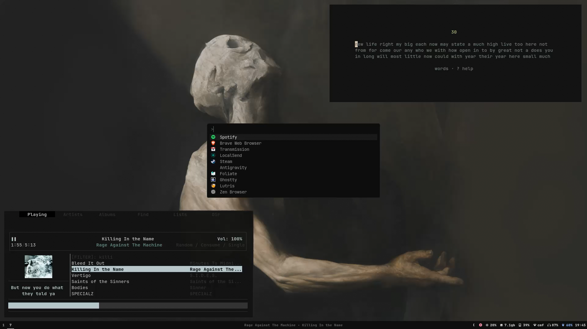

# nixos-btw



My NixOS config. It probably won't work on your machine out of the box, but feel free to look through it and steal whatever seems useful. That's honestly why I'm making it public.

This setup is targeted at developers who prefer a minimalist workflow.

If you end up using something, a mention would be appreciated, but it's not required. And if you hit the ⭐ button, that would genuinely make my day.

## what's in here

- **sway** (main compositor) + **niri** for laptop
- **fish** shell + starship prompt
- **tmux** with nixpkgs managed plugins
- **waybar** for the bar, **mako** for notifications
- **kanshi** for automatic display output switching (sway)
- **mpd** + **rmpc** for music, **mpdscribble** for last.fm scrobbling
- all configured through **Home Manager** modules so one `nixos-rebuild switch` applies everything

## hardware

AMD iGPU + NVIDIA RTX 2050, PRIME offload setup. display manager is greetd + tuigreet.

## if you want to try this

this is a flake. you'll need nix with flakes enabled.

```bash
# clone it
git clone https://github.com/vyrx-dev/nix-config
cd nix-config
```

**you'll definitely need to change:**

- `hardware-configuration.nix`: generate your own with `nixos-generate-config`
- hostnames in `flake.nix` and `configuration.nix`
- display outputs in `modules/home-manager/kanshi.nix` (profile names like `eDP-1`, `HDMI-A-1`)
- monitor names and positions in `modules/home-manager/files/niri/config.kdl`
- the `mpdscribble` last.fm username in `modules/home-manager/mpdscribble.nix`
  and create `~/.config/mpdscribble/lastfm-password` manually (don't put passwords in the store)

once you've sorted those out:

```bash
sudo nixos-rebuild switch --flake .
```

## structure

```
modules/
  nixos/          # system-level config (niri session, portals)
  home-manager/   # everything user-facing (apps, dotfiles, services)
    files/        # raw configs deployed as-is (niri kdl, sway, rmpc, waybar css)
```

everything in `modules/home-manager/files/` is a raw config file deployed via `xdg.configFile`. apps with proper Home Manager modules (ghostty, fish, kitty, tmux, etc.) use their native nix options instead.
