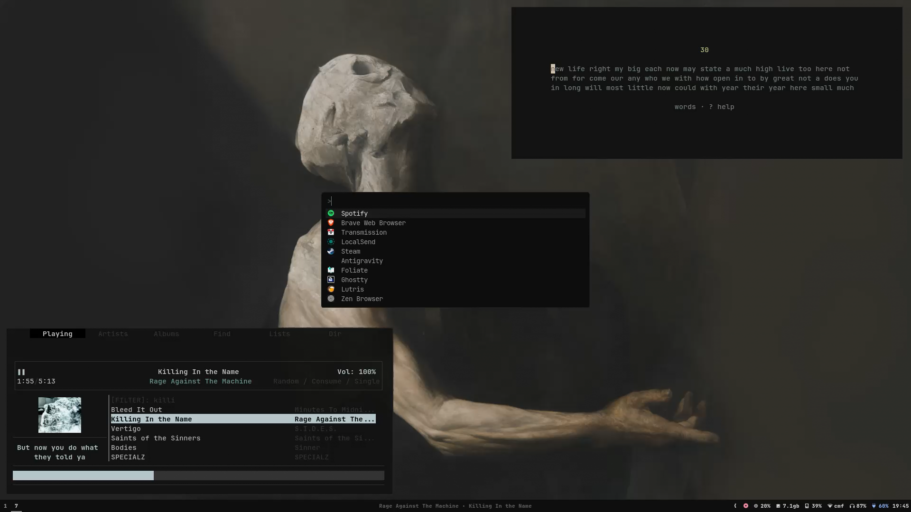

# nixos-btw



My NixOS config, featuring three different setups:
- **Sway** (with custom apps)
- **Niri** and **Umbriel** (with Noctalia)

It probably won't work on your machine out of the box, but feel free to look through it and steal whatever seems useful. That's honestly why I'm making it public.

```bash
git clone https://github.com/vyrx-dev/nix-config && cd nix-config
# edit hardware-configuration.nix, hostnames, and display outputs first
sudo nixos-rebuild switch --flake .
```

> [!WARNING]
> Never put passwords or API tokens in Nix files. The Nix store is world-readable.

good luck.
